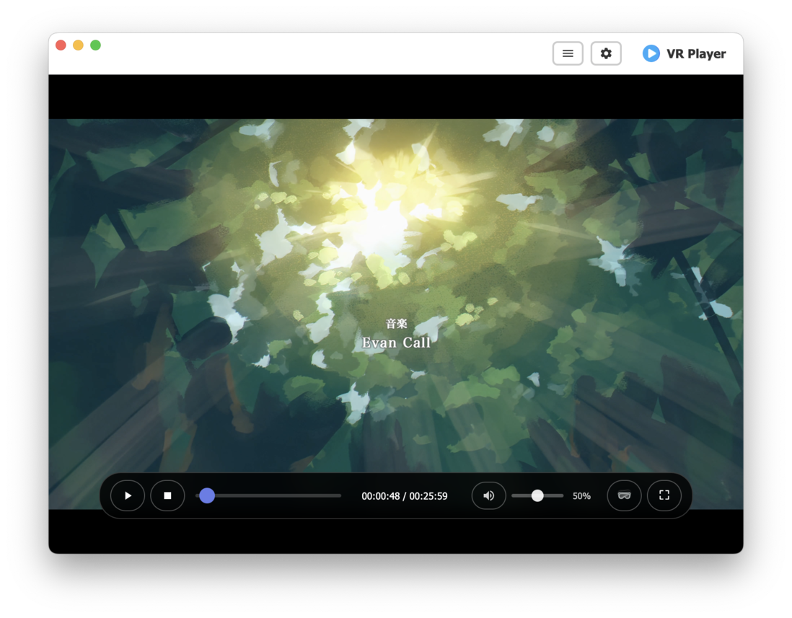

<div align="center">
  
  <h1>VR Player</h1>
  <p>一个基于 Electron 的现代化 VR 视频播放器</p>
  
  [](https://opensource.org/licenses/MIT)
  [](https://www.electronjs.org/)
  [](https://nodejs.org/)
  
  [English](README_EN.md) | 中文
</div>

## 📷 应用截图

<div align="center">
  
  
</div>

## 📖 目录

- [功能特性](#功能特性)
- [快速开始](#快速开始)
- [使用说明](#使用说明)
- [快捷键](#快捷键)
- [VR 功能](#vr-功能)
- [技术栈](#技术栈)
- [许可证](#许可证)
- [贡献](#贡献)

## ✨ 功能特性

- 🎬 **多格式支持**: 支持 MP4, WebM, AVI, MOV, MKV, M4V 等主流视频格式
- 🥽 **VR 模式**: 支持 360 度全景视频和 180 度半球视频
- 🎯 **智能识别**: 根据文件名自动识别VR视频并设置相应模式
- 👁️ **单眼优化**: 专为 SBS 格式的VR视频优化，避免画面压缩
- 📁 **文件管理**: 支持单个文件播放和拖拽导入
- 🎛️ **播放控制**: 完整的播放控制功能（播放/暂停、进度控制、音量调节）
- ⚙️ **设置面板**: 可自定义视频质量、VR 模式、自动播放等设置
- 🎨 **现代化 UI**: 美观的毛玻璃效果界面设计
- ⌨️ **快捷键支持**: 完整的键盘快捷键支持
- 🖱️ **鼠标追踪**: VR 模式下智能鼠标追踪和指针锁定

## 🚀 快速开始

### 环境要求

- Node.js 16.0 或更高版本
- npm 或 yarn 包管理器
- 支持 WebGL 的浏览器内核

### 安装步骤

1. **安装 Node.js**
   ```bash
   # Windows（推荐使用 winget）
   winget install OpenJS.NodeJS
   
   # macOS（使用 Homebrew）
   brew install node
   
   # Linux（Ubuntu/Debian）
   sudo apt update && sudo apt install nodejs npm
   ```

2. **验证安装**
   ```bash
   node --version
   npm --version
   ```

3. **克隆项目并安装依赖**
   ```bash
   git clone <repository-url>
   cd VRPlayer
   npm install
   ```

4. **启动应用**
   ```bash
   # 生产模式
   npm start
   
   # 开发模式（带开发者工具）
   npm run dev
   ```

5. **构建应用**
   ```bash
   # 构建所有平台（Windows、macOS、Linux）
   npm run dist:all
   
   # 构建单个平台
   npm run dist:win      # Windows
   npm run dist:mac      # macOS
   npm run dist:linux    # Linux
   ```

## 📝 使用说明

### 基本操作

1. **打开视频文件**
   - 点击"打开视频文件"按钮
   - 使用快捷键 `Ctrl+O` (Windows/Linux) 或 `Cmd+O` (macOS)
   - 直接拖拽视频文件到播放器

2. **播放控制**
   - 播放/暂停: 点击播放按钮或按空格键
   - 停止: 点击停止按钮
   - 进度控制: 拖动进度条或使用左右箭头键、鼠标侧键
   - 音量控制: 使用上下箭头键或鼠标滚轮

3. **VR 模式**
   - 点击 VR 按钮或按 `F11` 进入 VR 模式
   - 按 `Escape` 退出 VR 模式
   - 使用鼠标或 VR 控制器进行视角控制

### 设置选项

- **视频质量**: 自动、1080p、720p、480p
- **VR 模式**: 360 度全景、180 度半球、立体 3D
- **自动播放**: 文件加载后自动开始播放
- **循环播放**: 视频结束后自动重新播放

## ⌨️ 快捷键

### 通用按键

| 按键 | 功能 |
|------|------|
| **空格** | 播放/暂停 |
| **M** | 静音/取消静音 |
| **Ctrl+F** / **Enter** | 切换全屏 |
| **F11** | 进入/退出VR模式 |
| **↑** / **↓** | 音量调节 |
| **←** / **→** / **鼠标侧键** | 快退/快进 10 秒 |
| **Ctrl+O** | 打开文件 |

### VR 模式专用按键

| 按键 | 功能 |
|------|------|
| **K** | 切换鼠标追踪模式 |
| **I** | 切换180°/360°模式 |
| **R** | 重置VR缩放 |
| **V** | 重置VR视角（默认居中到左眼） |
| **C** | 居中到中心位置 |
| **Escape** | 退出VR模式 |

## 🥽 VR 功能

### 支持的 VR 模式

- **360 度全景**: 完整的球形视频
- **180 度半球**: 半球形视频
- **立体 3D**: 支持 3D 立体视频

### 自动识别功能

播放器会根据文件名自动识别VR视频并设置相应模式：

**180度视频关键词**:
- `180`、`180°`、`180度`
- `4k180`、`8k180`、`180p`
- `180vr`、`vr180`
- `hemisphere`、`half-sphere`、`front180`

**360度视频关键词**:
- `360`、`360°`、`360度`
- `4k360`、`8k360`、`360p`
- `360vr`、`vr360`
- `spherical`、`equirectangular`、`full-sphere`

**默认行为**: 检测到VR视频但无明确角度标识时，默认使用180度模式。

### VR 单眼模式说明

为了在普通显示器上获得最佳的VR视频观看体验，播放器默认使用**单眼模式**：

- **优点**: 画面更清晰，无压缩变形
- **原理**: 只显示并排立体视频的左半部分
- **适用**: 大多数SBS格式的VR视频

### 视角控制

- **自动左眼居中**: 打开VR视频时自动将视角移动到左眼画面的中心
- **手动控制**: 
  - `V键`: 重置视角（默认居中到左眼）
  - `C键`: 居中到视频中心位置
- **鼠标追踪**: `K键` 切换鼠标追踪模式

## 🛠️ 技术栈

- **Electron**: 桌面应用框架
- **A-Frame**: WebVR 框架
- **Three.js**: 3D 图形库
- **HTML5 Video**: 视频播放
- **CSS3**: 现代化样式设计

## 📄 许可证

本项目采用 MIT 许可证。详情请参阅 [LICENSE](LICENSE) 文件。

## 🤝 贡献

我们欢迎各种形式的贡献！请阅读以下指南：

1. **报告问题**: 在 Issues 中报告 bug 或提出功能请求
2. **提交代码**: 
   - Fork 本项目
   - 创建功能分支 (`git checkout -b feature/AmazingFeature`)
   - 提交更改 (`git commit -m 'Add some AmazingFeature'`)
   - 推送到分支 (`git push origin feature/AmazingFeature`)
   - 创建 Pull Request

3. **代码规范**: 请遵循现有的代码风格和约定

## 🎯 路线图

- [ ] 支持更多视频格式
- [ ] 添加字幕支持
- [ ] 实现播放列表功能
- [ ] 支持网络流媒体
- [ ] 添加更多 VR 交互功能
- [ ] 优化性能和内存使用

---

<div align="center">
  <p>如果这个项目对您有帮助，请给我们一个 ⭐️ 支持！</p>
  <p>Made with ❤️ by VR Player Team</p>
</div> 