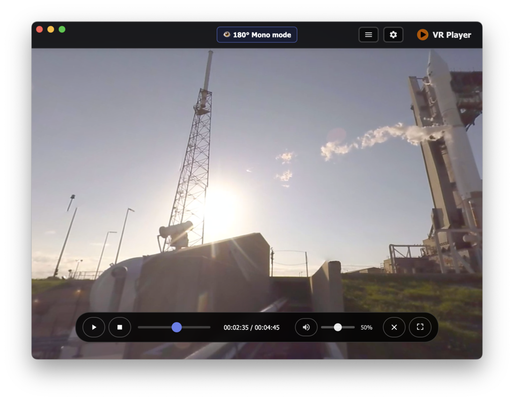

<div align="center">
  
  <h1>VR Player</h1>
  <p>A Modern VR Video Player Built with Electron</p>
  
  [](https://opensource.org/licenses/MIT)
  [](https://www.electronjs.org/)
  [](https://nodejs.org/)
  
  English | [中文](README.md)
</div>

## 📷 Screenshots

<div align="center">
  
   
</div>

## 📖 Table of Contents

- [Features](#features)
- [Quick Start](#quick-start)
- [Usage](#usage)
- [Keyboard Shortcuts](#keyboard-shortcuts)
- [VR Features](#vr-features)
- [Tech Stack](#tech-stack)
- [License](#license)
- [Contributing](#contributing)

## ✨ Features

- 🎬 **Multi-format Support**: Supports MP4, WebM, AVI, MOV, MKV, M4V and other mainstream video formats
- 🥽 **VR Mode**: Supports 360-degree panoramic and 180-degree hemisphere videos
- 🎯 **Smart Recognition**: Automatically identifies VR videos based on filename and sets appropriate mode
- 👁️ **Single-eye Optimization**: Optimized for SBS format VR videos to avoid image compression
- 📁 **File Management**: Supports single file playback and drag-and-drop import
- 🎛️ **Playback Control**: Complete playback control (play/pause, progress control, volume adjustment)
- ⚙️ **Settings Panel**: Customizable video quality, VR mode, auto-play settings
- 🎨 **Modern UI**: Beautiful frosted glass effect interface design
- ⌨️ **Keyboard Shortcuts**: Complete keyboard shortcut support
- 🖱️ **Mouse Tracking**: Smart mouse tracking and pointer lock in VR mode

## 🚀 Quick Start

### Requirements

- Node.js 16.0 or higher
- npm or yarn package manager
- WebGL-compatible browser kernel

### Installation Steps

1. **Install Node.js**
   ```bash
   # Windows (recommended using winget)
   winget install OpenJS.NodeJS
   
   # macOS (using Homebrew)
   brew install node
   
   # Linux (Ubuntu/Debian)
   sudo apt update && sudo apt install nodejs npm
   ```

2. **Verify Installation**
   ```bash
   node --version
   npm --version
   ```

3. **Clone Project and Install Dependencies**
   ```bash
   git clone <repository-url>
   cd VRPlayer
   npm install
   ```

4. **Start Application**
   ```bash
   # Production mode
   npm start
   
   # Development mode (with developer tools)
   npm run dev
   ```

5. **Build Application**
   ```bash
   # Build all platforms (Windows, macOS, Linux)
   npm run dist:all
   
   # Build single platform
   npm run dist:win      # Windows
   npm run dist:mac      # macOS
   npm run dist:linux    # Linux
   ```

## 📝 Usage

### Basic Operations

1. **Open Video File**
   - Click "Open Video File" button
   - Use keyboard shortcut `Ctrl+O` (Windows/Linux) or `Cmd+O` (macOS)
   - Drag and drop video file directly to the player

2. **Playback Control**
   - Play/Pause: Click play button or press spacebar
   - Stop: Click stop button
   - Progress Control: Drag progress bar or use left/right arrow keys or mouse side buttons
   - Volume Control: Use up/down arrow keys or mouse wheel

3. **VR Mode**
   - Click VR button or press `F11` to enter VR mode
   - Press `Escape` to exit VR mode
   - Use mouse or VR controller for view control

### Settings Options

- **Video Quality**: Auto, 1080p, 720p, 480p
- **VR Mode**: 360-degree panoramic, 180-degree hemisphere, stereo 3D
- **Auto-play**: Automatically start playing after file loads
- **Loop Playback**: Automatically replay after video ends

## ⌨️ Keyboard Shortcuts

### General Keys

| Key | Function |
|-----|----------|
| **Space** | Play/Pause |
| **M** | Mute/Unmute |
| **Ctrl+F** / **Enter** | Toggle Fullscreen |
| **F11** | Enter/Exit VR Mode |
| **↑** / **↓** | Volume Control |
| **←** / **→** / **Mouse Side Buttons** | Seek backward/forward 10 seconds |
| **Ctrl/Cmd+O** | Open File |

### VR Mode Specific Keys

| Key | Function |
|-----|----------|
| **K** | Toggle Mouse Tracking Mode |
| **I** | Toggle 180°/360° Mode |
| **R** | Reset VR Zoom |
| **V** | Reset VR View (default center to left eye) |
| **C** | Center to Center Position |
| **Ctrl/Cmd+Up/Down** | VR Mode Zoom |
| **Escape** | Exit VR Mode |

## 🥽 VR Features

### Supported VR Modes

- **360-degree Panoramic**: Complete spherical video
- **180-degree Hemisphere**: Hemispherical video
- **Stereo 3D**: Support for 3D stereo video

### Auto-recognition Feature

The player automatically identifies VR videos based on filename and sets appropriate mode:

**180-degree Video Keywords**:
- `180`, `180°`, `180度`
- `4k180`, `8k180`, `180p`
- `180vr`, `vr180`
- `hemisphere`, `half-sphere`, `front180`

**360-degree Video Keywords**:
- `360`, `360°`, `360度`
- `4k360`, `8k360`, `360p`
- `360vr`, `vr360`
- `spherical`, `equirectangular`, `full-sphere`

**Default Behavior**: When VR video is detected but no clear angle indication, defaults to 180-degree mode.

### VR Single-eye Mode

For optimal VR video viewing experience on regular displays, the player defaults to **single-eye mode**:

- **Advantages**: Clearer image, no compression distortion
- **Principle**: Only displays the left half of side-by-side stereo video
- **Applicable**: Most SBS format VR videos

### View Control

- **Auto Left-eye Center**: Automatically moves view to left eye image center when opening VR video
- **Manual Control**: 
  - `V Key`: Reset view (default center to left eye)
  - `C Key`: Center to video center position
- **Mouse Tracking**: `K Key` toggles mouse tracking mode

## 🛠️ Tech Stack

- **Electron**: Desktop application framework
- **A-Frame**: WebVR framework
- **Three.js**: 3D graphics library
- **HTML5 Video**: Video playback
- **CSS3**: Modern styling

## 📄 License

This project is licensed under the MIT License. See the [LICENSE](LICENSE) file for details.

## 🤝 Contributing

We welcome contributions of all kinds! Please read the following guidelines:

1. **Report Issues**: Report bugs or feature requests in Issues
2. **Submit Code**: 
   - Fork the project
   - Create feature branch (`git checkout -b feature/AmazingFeature`)
   - Commit changes (`git commit -m 'Add some AmazingFeature'`)
   - Push to branch (`git push origin feature/AmazingFeature`)
   - Create Pull Request

3. **Code Standards**: Please follow existing code style and conventions

## 🎯 Roadmap

- [ ] Support more video formats
- [ ] Add subtitle support
- [ ] Implement playlist functionality
- [ ] Support network streaming
- [ ] Add more VR interaction features
- [ ] Optimize performance and memory usage

---

<div align="center">
  <p>If this project helps you, please give us a ⭐️ for support!</p>
  <p>Made with ❤️ by VR Player Team</p>
</div> 